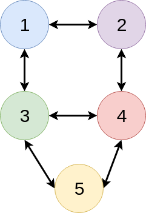
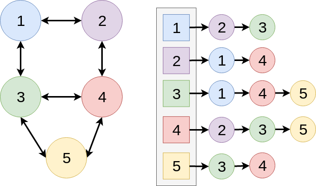
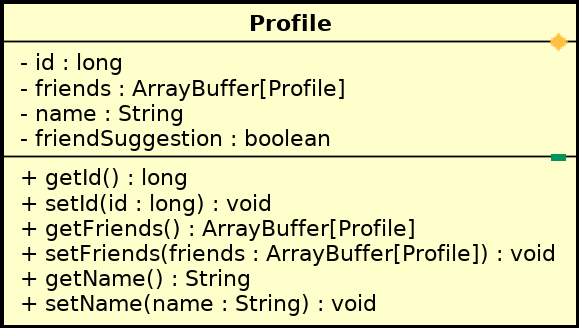
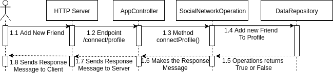
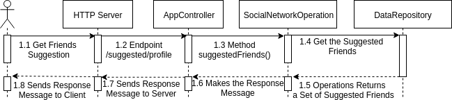
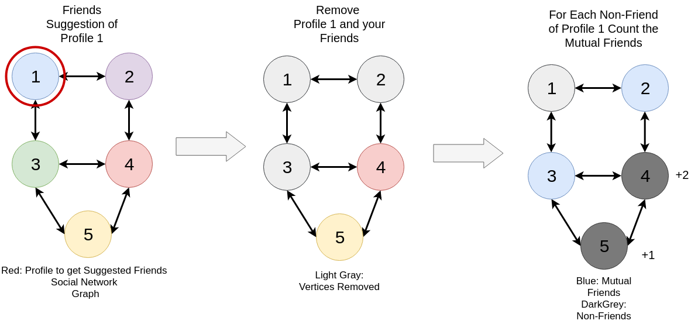
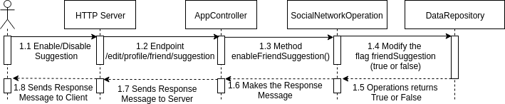

# Nukr - Social Network
> Social media product by Nu Everything S/A

The Nukr is a new Social Network provided by the Nu Everything S/A. 
This project uses the concepts of Functional Programming, Directed Graph, RESTful API implemented in Scala language.
The primary functionalities of the Nukr, consist in the: (i) creation a new user profile; (ii) connects to profiles as a friend; (iii) enable to get friends suggestion.

## Installation

The Nukr was built in the Maven project structure, and has the following directory tree:

```
├── src
│   ├── main
│   │   ├── resources
│   │   └── scala
│   │       └── com
│   │           └── exercise
│   │               └── scala
│   │                   └── socialnetwork
│   │                       ├── controller
│   │                       ├── model
│   │                       ├── respository
│   │                       └── util
│   └── test
```

Also, the Maven was used for the management of dependencies of this project. The project was built in IntelliJ IDEA, you can use this IDE to compile and run the tests.

To run Nukr - Social Network, just run the following command:

```sh
mvn spring-boot:run
```

## How it Works

The system is modeled with the Graph Theory, using the implementation of Adjacency List. 
The Figure 1, shows how the Nukr social network was built.

<p align="center"><br>Figure 1: Social Netwrok Graph.</p>

Figure 1 presents a Graph data structure that is defined as the *G(V, E)* function. The **V** is the vertices (circles) and **E** the edges (arrows). In the Nukr Social Network, the Vertices is the profiles users, and the Edge is the connection among the profiles (friendship). To implement this model the Adjacency List was used. The Figure 2, show how the Adjacency List was implemented.

<p align="center"><br>Figure 2: Adjacency List.</p>

For the development of Adjacency List was defined a user *Profile* object of the Social Network. Figure 3 describes the attributes and methods of this implementation.

<p align="center"><br>Figure 3: Profile Class Diagram.</p>

The ArrayBuffer (collection of Scala lang) was used for the construction of the Adjacency List. The instance of the ArrayBuffer represents the our graph implementation:

 ```scala
 var graph: ArrayBuffer[Profile]
 ```

Finally, the Nukr RESTful API was implemented with Spring Framework, by the definition of endpoints which perform the activities of the social network.

## Usage Example

Four endpoints are developed in the Nukr RESTFul API: (i) add a new profile; (ii) connect two profile as a friend; (iii) get a list of friends suggestion; and, (iv) enable or disable friend suggestion.

1. Add new Profile ("/api/add/profile")
```
Description: Function that allows the creation of new profile.
```

Figure 4 illustrates how the new profile execution flow works. A client performs a request to the HTTP Server with the own IP, Port number and endpoint ("/api/add/profile"), then the request is scheduled to ```AppController```, which deserialize the data retrieved, and later call the ```SocialNetworkOperation``` to execute the insertion of the new profile into the ```DataRepository```. The ```DataRepository``` is a Singleton Object, which performs the CRUD operation in process memory data storage.

<p align="center"><br>Figure 4: Sequence Diagram (Add new Profile).</p>

2. Connect two Profiles ("/api/connect/profile")
```
Description: A function that allows the creation of a new profile.
```

Figure 5 shows the execution flow of the add new friend by the client. Firstly, the client sends your profile id and of the requested friend to the Server. The Server sends the data to ```AppController```, which extract the id of the profiles (id1 = client, id2 = new profile friend), then method connectProfile() performs the new friendship connection between the profiles. Finally, the operation status is returned (true or false) to the client. The connection between friends are bi-direction, both profiles has a edge with the reference or your friends.

<p align="center"><br>Figure 5: Sequence Diagram (Add new Friend).</p>

3. Get Friends Suggestion ("/api/suggested/profile")
```
Description: A function that allows getting a list of suggested friends order by the number of mutual friends that non-friend profile contains.
```

Figure 6 shows how the operation to get the suggested friends works. Firstly, the client performs a friend suggestion request, which is executed by ```AppController``` and then ```SocialNetworkOperation```. Then, the recommendation algorithm collects all not friends of the client that has mutual friends with him, then count how many mutual friends the profile has. Finally, a set of users profiles with the number of mutual friends are sorted in ```Order By DESC```, indicating the best possible friends the client can add.

<p align="center"><br>Figure 6: Sequence Diagram (Suggested Friends).</p>

For example, give the operation of suggested friends on ```Profile 1```:

<p align="center"><br>Figure 7: Friends Suggestion Flow.</p>

Figure 7 shows the execution flow of the algorithm of the friend's suggestion. Firstly, to find the suggested friends of ```Profile 1``` removes the friends and the ```Profile 1``` of the search. Then, for each non-friend of ```Profile 1``` count how many mutual friends the profile has. Finally, returns a list of sorted profiles that have mutual friends.

4. Enable or Disable Friend Suggestion ("/api/edit/profile/friend/suggestion")
```
Description: A function that allows to enable or disable the function of getting suggested friends by a profile.
```

Finally, Figure 8 illustrates the operation of ```enable/disable``` friends suggestion. If one profile does not want to be recommended to another profile, the flag ```friendSuggestion``` can be modified to ```false```. To do this, the client sends your identification to the server requiring the disable of friends suggestion feature. The ```AppController``` receives the request and then sends to ```SocialNetworkOperation``` that performs the enabling/disabling the friend suggestion variable condition. Subsequently, the operation returns ```true or false``` to the client.

<p align="center"><br>Figure 8: Sequence Diagram (Enable/Disable Suggested Friends).</p>

## Development Enviroment

### Unit Tests

All unit tests can be found in the ```/test``` folder. To run the unit test, just run the command:

```bash
mvn test
```

### Postman 

All examples of requests are exported in the Postman Testing API. To run this test, you can import the json file of the test located in:

```bash
assets/test/postman/nukr-postman.json
```

### API Documentation

The API was written with Swagger 2. To access the documentation enter the following URL in your browser:

```
https://app.swaggerhub.com/apis/v4ires/nukr-social-network/1.0.0
```

### Libraries and Licenses

Table 1 exposes the set of libraries used, describing your versions and licenses.

<center>Table 1: External Libraries.</center>
<center>

|         Library         |    Version    |          License           |
|:-----------------------:|:-------------:|:--------------------------:|
|      scala-library      |     2.12.6    |        BSD 3-clause        |
|           gson          |     2.8.5     |         Apache 2.0         |
|     logback-classic     |     1.1.2     | EPL v1.0 and the LGPL 2.1  |
|     Junit               |     4.12      | Eclipse Public License 1.0 |
| spring-boot-starter-web | 2.0.4.RELEASE |         Apache 2.0         |

</center>

## Release History

* 0.0.1
    * First Release